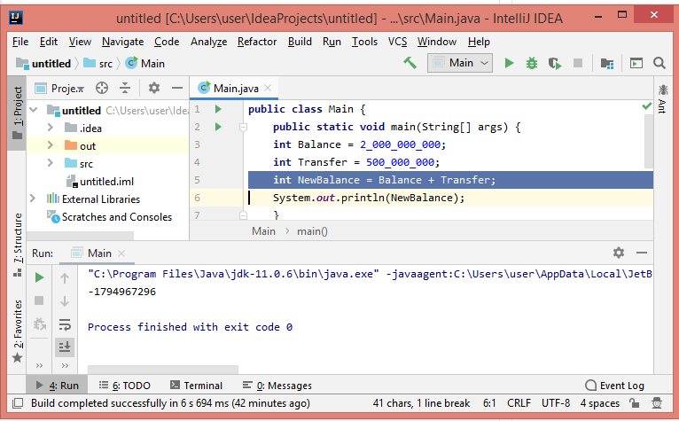

# Отчёт о тестировании приложения "Money Transfer"

## Краткое описание

После совершения операции пополнения счета клиента произошло некорректное отображение остатка: программа вывела отрицательный результат. Проверка кода показала, что переменной NewBalance (баланс счета клиента после пополнения) присвоен неверный тип данных. Итоговое количество символов переменной NewBalance превысило допустимое значение для типа данных int.

## Описание тестов

Проведено позитивное функциональное тестирование. Протестирован модуль вывода баланса счета клиента после совершения операции перевода средств (пополнение счета). Тестирование проводилось методом белого ящика с запуском части кода на исполнение:

## Результаты

1. 50% успешных тестов: при присвоении переменной NewBalance значения, соответствующего типу данных int, программа возвращала корректный результат. В противном случае - возвращался результат с ошибкой.
2. Баг-репорт https://github.com/OlgaNorina/Money-Transfer/issues/1#issue-566090711

## Общие рекомендации
*Задать переменным Balance, Transfer, NewBalance тип данных long*
